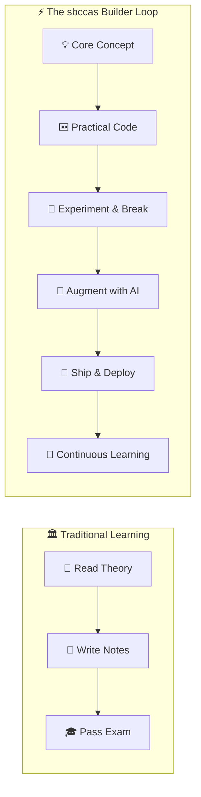
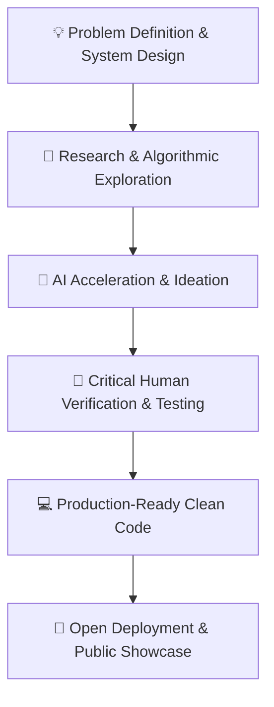

<div align="center">

# 🧠 sbccas

### **Learning Beyond the Classroom. Building for the AI Era.**

<p align="center">
  <em>Where Computer Science Education Meets Technology, Data & Artificial Intelligence.</em>
</p>

<p align="center">
  <a href="https://www.amrolicollege.ac.in"></a>
  <a href="https://vnsgu.ac.in"></a>
  <a href="https://github.com/sbccas"></a>
  
</p>

<p align="center">
  
  
  
  
  
  
  
  
  
</p>

<p align="center">
  <a href="website/index.html"><strong>🌐 Explore Web Portal</strong></a> &nbsp;•&nbsp;
  <a href="docs/GETTING_STARTED.md"><strong>🚀 Start Learning</strong></a> &nbsp;•&nbsp;
  <a href="docs/learning-paths/bca.md"><strong>🗺️ Learning Paths</strong></a> &nbsp;•&nbsp;
  <a href="docs/AI_ERA_LEARNING.md"><strong>🤖 AI-Era Learning</strong></a> &nbsp;•&nbsp;
  <a href="data/repositories.json"><strong>📦 Repository Catalog</strong></a>
</p>

---

</div>

## 🌌 Overview

Welcome to **sbccas** — the open academic technology ecosystem of **Sutex Bank College of Computer Applications and Science (Amroli College)**, managed by Jivan Jyot Trust and affiliated with **Veer Narmad South Gujarat University (VNSGU)**.

This ecosystem bridges the gap between traditional academic curricula and modern engineering workflows. We bring together academic resources, hands-on programming labs, interactive notebooks, datasets, capstone projects, and AI explorations to empower students to build real-world software.

> **"The syllabus provides the foundation. Technology provides the playground. Curiosity provides the direction."**

---

## 🚀 The Builder Mindset

We believe computing education must evolve beyond memorization into active creation, experimentation, and deployment.



Moving from:
> ❌ *"Give me the program."*

Towards:
> ✅ **"I built this. Here is the problem it solves, and here is how it works."**

---

## 🎓 Academic Disciplines & Focus Areas

Our repositories are organized around university curricula while actively encouraging students to expand their horizons:

| Discipline | Core Domains | Practical Outcomes |
| :--- | :--- | :--- |
| 💻 **BCA** | Programming (C, C++, Java, Python), Web Technologies, DBMS, OS | Full-stack apps, robust database design, system logic |
| 🤖 **BCA – AI** | Machine Learning, Generative AI, Neural Networks, Prompt Engineering | Intelligent apps, agentic workflows, model inference |
| 📊 **B.Sc. Data Science** | Data Analysis, Visualization, Statistics, Pandas, NumPy | Predictive models, exploratory data notebooks, analytics |
| 🌐 **B.Sc. IT** | Network Architectures, Systems Administration, Cloud, Cyber | Scalable system setups, API integrations, DevOps basics |

---

## 🤖 Welcome to the AI Era

Artificial Intelligence is reshaping how software is designed, engineered, and shipped. We train students not just to consume AI tools, but to **work intelligently alongside AI systems**.



### The Golden Rule
> **Use AI to accelerate learning — never to replace critical thinking.**

Students are mentored to deeply understand the code they commit, the datasets they clean, and the architectural decisions they make.

---

## 🧪 Your Digital Learning Laboratory

A GitHub repository is more than a download folder — it is your digital engineering workshop:

| Laboratory Space | Role & Functionality |
| :--- | :--- |
| 📚 **Digital Notebook** | Curated reference architectures, notes, and concept cheat-sheets |
| 🧪 **Experimental Sandbox** | Isolated codebases to test algorithms, break syntax, and debug errors |
| 💻 **Modern Workspace** | Industrial version control with Git, issue tracking, and clean commits |
| 📊 **Data Playground** | Real-world datasets, statistical exploratory analysis, and visualization |
| 🤖 **AI Experiment Lab** | Hands-on experiments with LLMs, prompt pipelines, and embeddings |
| 🚀 **Public Portfolio** | Proof of competence for internships, placements, and open-source impact |

---

## 🛠️ The Modern Developer Workflow

Technical literacy goes beyond coding syntax. We instill industry-standard developer habits from day one:

```
[Problem Formulation] ➔ [Research & Architecture] ➔ [Implementation]
                                                          │
[Iterative Feedback]  ⇦ [Deploy & Showcase]       ⇦ [Version Control & PR]
```

* **Version Control:** Clean branching, conventional commit messages, and collaborative pull requests.
* **Modern Toolchains:** VS Code, JupyterLab, Google Colab, virtual environments, and package managers.
* **Documentation:** Production-grade `README.md`, docstrings, and inline technical explanations.
* **Reproducibility:** Clean dependency manifests (`requirements.txt`, `package.json`).

---

## 🗺️ Ecosystem Directory & Quick Navigation

Explore curated resources across the **sbccas** organization:

| Category | Description | Access |
| :--- | :--- | :--- |
| 📂 **Academic Courseware** | Lecture supplements, syllabus solutions, and laboratory manuals | [Browse Repositories](https://github.com/sbccas?tab=repositories&q=academic) |
| 🐍 **Python & AI Notebooks** | Google Colab & Jupyter notebooks covering ML, NLP, and AI workflows | [Browse AI Labs](https://github.com/sbccas?tab=repositories&q=ai) |
| 📊 **Data Science Tracks** | Practical data sets, statistical analysis, and visualization scripts | [Browse Data Science](https://github.com/sbccas?tab=repositories&q=data) |
| 💻 **Core Programming** | Fundamental programming assignments in C, C++, Java, and Web Dev | [Browse Coding Labs](https://github.com/sbccas?tab=repositories&q=programming) |
| 🚀 **Capstone & Mini Projects** | Student-built applications, APIs, and real-world system prototypes | [Browse Projects](https://github.com/sbccas?tab=repositories&q=project) |

---

## 🔭 What We Train Students to Become

We cultivate problem solvers equipped for the future:

* 💡 **Problem Decomposers:** Able to break ambiguous real-world problems into clear modular algorithms.
* 💻 **Engineered Coders:** Proficient in writing structured, readable, and maintainable software.
* 🤖 **AI-Augmented Builders:** Skilled at leveraging LLMs and AI assistants responsibly and productively.
* 🐞 **Tenacious Debuggers:** Reading stack traces with confidence and isolating edge-case failures.
* 🌐 **Collaborative Contributors:** Comfortable with Git workflows, code reviews, and open-source standards.
* 🔁 **Lifelong Learners:** Agile and self-directed enough to learn whatever framework emerges next.

---

## 📊 Live Ecosystem Activity

<div align="center">
  
  &nbsp;
  
</div>

---

## 🤝 Community & Collaboration

### 🧑‍🎓 For Students
* ⭐ **Star** the repositories you find helpful.
* 🍴 **Fork** the code, experiment locally, and build variations.
* 📢 **Document** your learning openly on your own GitHub profile.

### 👨‍🏫 For Educators & Mentors
* Utilize open repositories as interactive reference material for classroom sessions.
* Contribute lab assignments, problem statements, and real-world project blueprints.
* Foster an open academic culture where learning materials are freely accessible.

---

## 🌐 Connect & Institutional Information

**Sutex Bank College of Computer Applications & Science (Amroli College)**  
*Managed by Jivan Jyot Trust | Affiliated with Veer Narmad South Gujarat University (VNSGU)*  
Amroli, Surat, Gujarat, India.

<p align="left">
  <a href="https://www.amrolicollege.ac.in"></a>
  <a href="https://github.com/sbccas"></a>
  <a href="https://www.instagram.com/amrolibca/"></a>
  <a href="mailto:info@amrolicollege.ac.in"></a>
</p>

---

<div align="center">

> ### **The classroom is where learning begins.**  
> ### **The world is where you build.**

**— sbccas Ecosystem**

*Code. Create. Innovate. Building the next generation of computing minds.*

</div>
